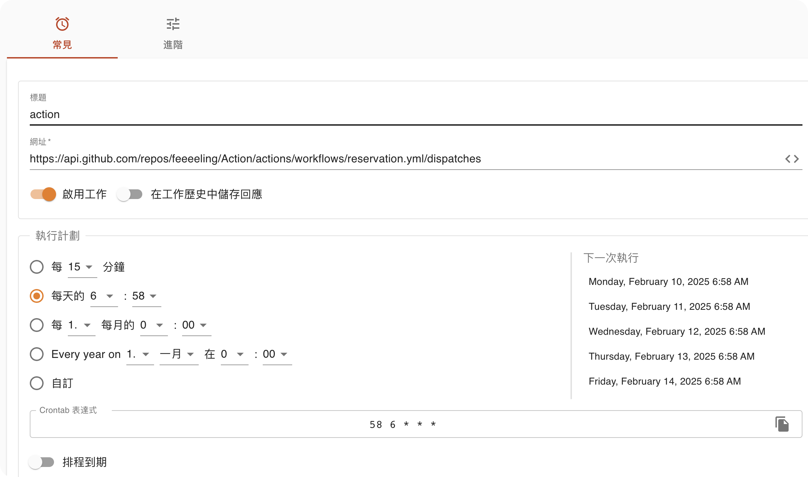
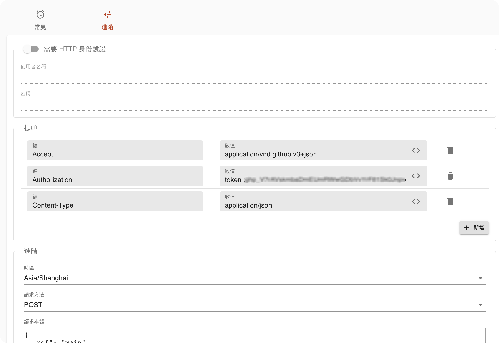
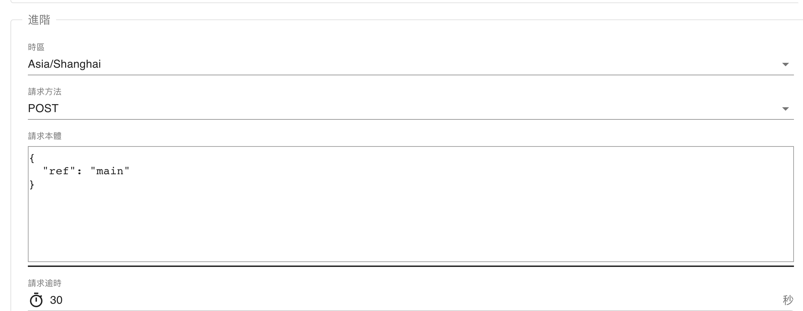
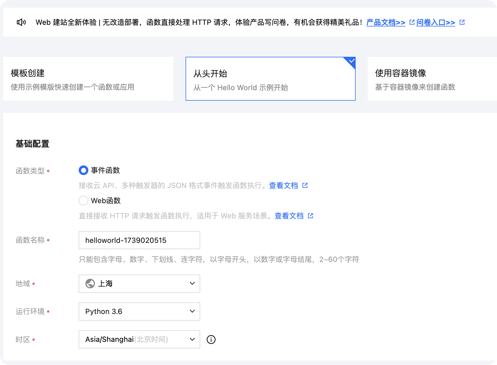
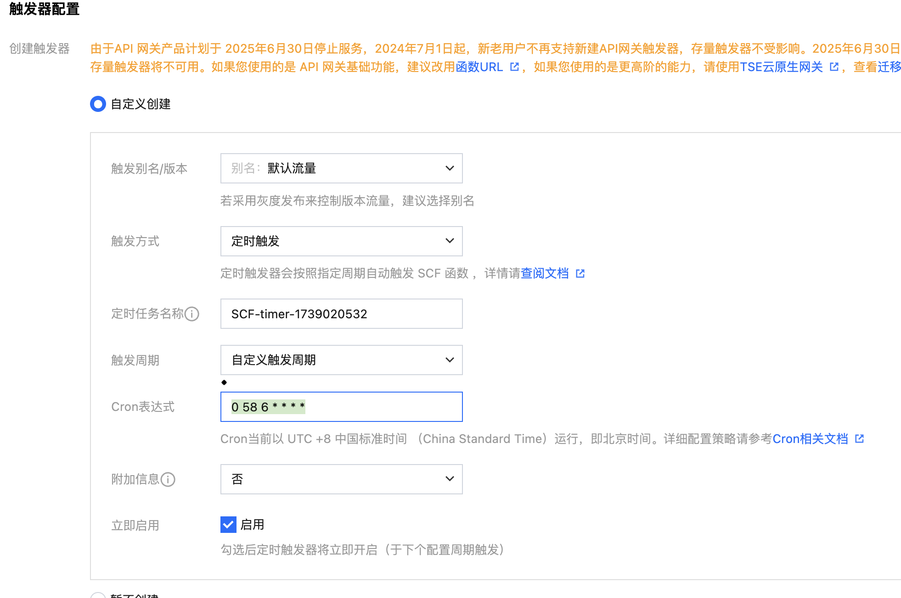

# 1. 账号密码配置
在`Settings->Secrets and Variables->Actions`中添加：
- `USERNAME`: 微校园账号
- `PASSWORD`: 微校园密码
- `RECEIVE_EMAIL`: 接收预定结果的邮箱
- `SEND_EMAIL`: 发送预定结果的邮箱（使用163邮箱，里面服务器写死了懒得改）
- `SEND_EMAIL_KEY`: 发送预定结果的邮箱的授权码
- `CAPCHA_USERNAME`：打码平台的账号（[去打码平台注册并充值几块钱](http://www.fdyscloud.com.cn)）
- `CAPCHA_PASSWORD`：打码平台的密码
# 2. 配置触发器
github本身的定时任务不知道为啥不会自动触发，所以借助云函数实现定时触发。
下面2选1
## cron-job.rog(推荐)
[注册并创建任务](https://console.cron-job.org)
下面网址修改为自己仓库对应的

**键和值参考下面腾讯云函数** **Authorization部分**， 以"token "开头，后面跟着自己的github token， 可以在 **点击头像**`Settings->Developer settings->Personal access tokens`中生成


## 腾讯云函数
- 注册[腾讯云](URL_ADDRESS- 注册[腾讯云](https://cloud.tencent.com/)

- 进入[云函数](URL_ADDRESS- 进入[云函数](https://console.cloud.tencent.com/scf/list?rid=1&ns=default)

- 创建函数


- 函数内容 **填充Authorization部分**， 以"token "开头，后面跟着自己的github token， 可以在 **点击头像**`Settings->Developer settings->Personal access tokens`中生成，**然后后面的请求地址改成自己的仓库地址对应的**
```py
import requests
import json

def run():
        payload = json.dumps({"ref": "main"})
        header = {'Authorization': 'token asdasdadas',
                  "Accept": "application/vnd.github.v3+json"}
        response_decoded_json = requests.post(
            f'https://api.github.com/repos/feeeeling/Action/actions/workflows/reservation.yml/dispatches',
            data=payload, headers=header)

# 云函数入口
def main_handler(event, context):
    return run()
```
- 触发器 
cron表达式
`0 58 6 * * * *` 表示每天6:58:00执行一次


# 3. 设置场地和时间
在`reservation.yml`中修改`--reservation-time`即可